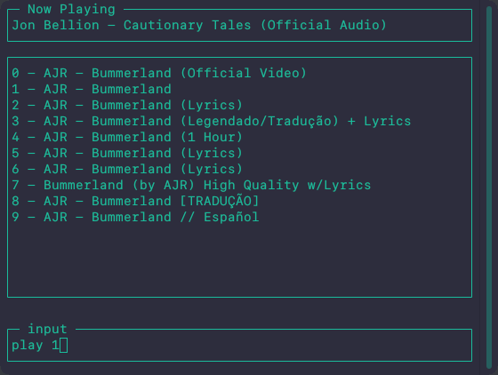
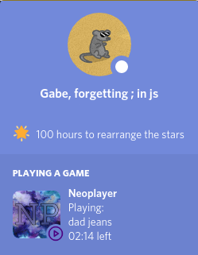

# Neoplayer

TUI Youtube audio player using MPV on the backend

## Installation

You need to have [MPV](https://mpv.io/) and [youtube-dl](https://youtube-dl.org/) installed.

Then install the libraries with:
```bash
npm install
```

## Screenshots

Neoplayer             |  Discord Rich Presence
:-------------------------:|:-------------------------:
  |  

## Usage

Run Neoplayer with:
```bash
node neoplayer.js
```

Commands currently available are (press 'h' to type commands):
```javascript
search <query> //searches youtube for the query and returns a list of results with indexes
play <index> //plays the index from the search list or adds it to the currently playing queue
p <query> //searches and then plays the first result, doesn't show list of results
pause //pauses the playback
skip //skips to the next track
volume <value> //sets the volume to the value specified
link //copies the song url to the clipboard
new <name> //creates a new playlist named <name>
add <playlist> //adds the song currently playing to <playlist>
plist <playlist> //add all songs from <playlist> to the queue
q //quits Neoplayer
```
## Contributing
Feel free to open issues and make pull requests, I'll do my best to work on them.

## License
[GNU General Public License v2.0](LICENSE)
